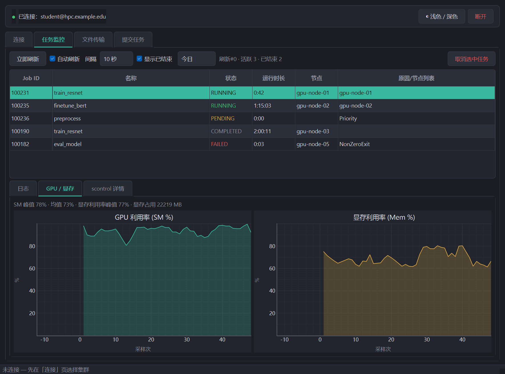
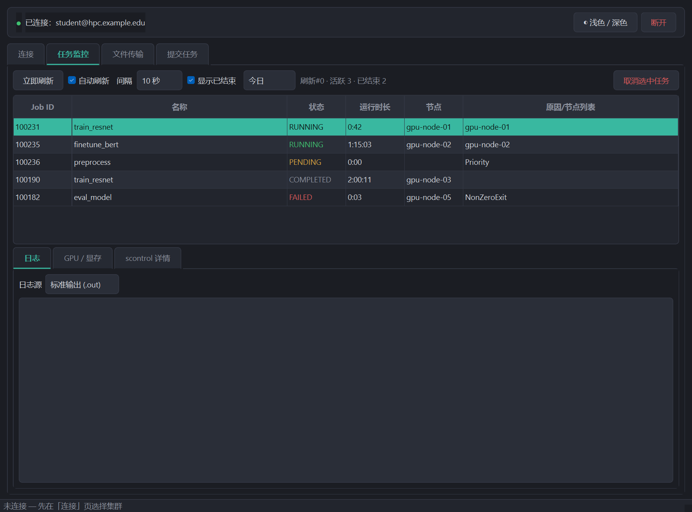
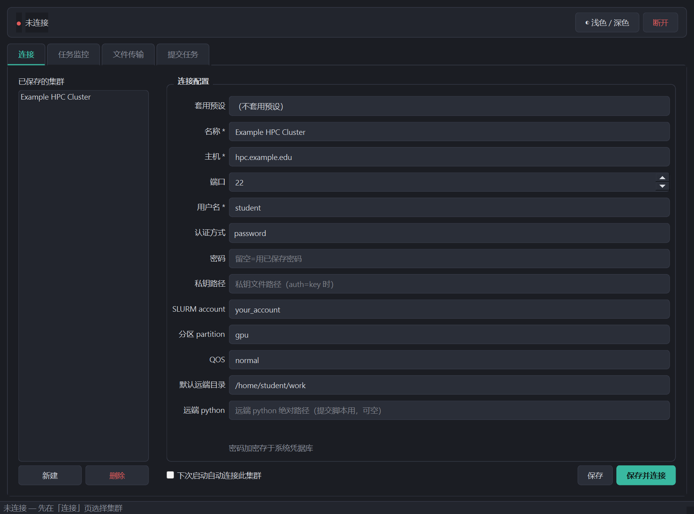
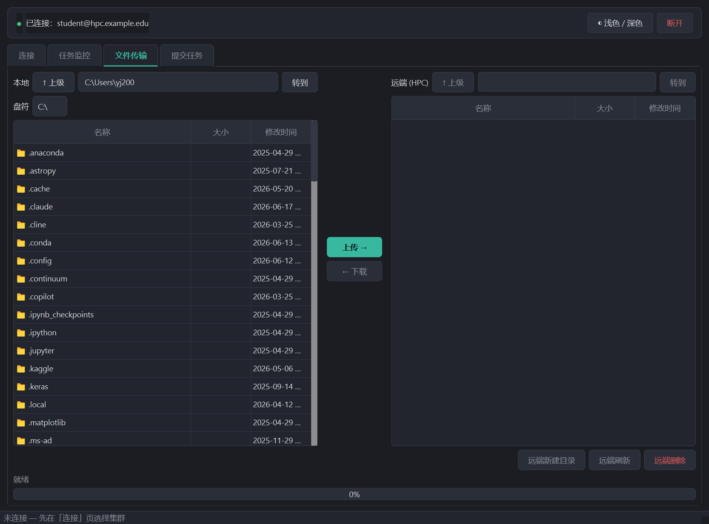
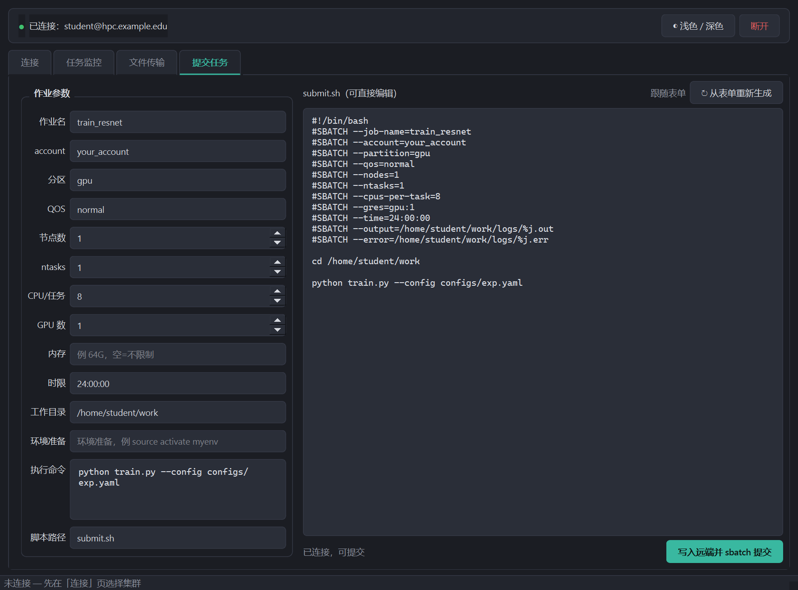

<div align="center">

# 🖥️ HPC Companion

### 给学生用的 SLURM 集群图形客户端

把繁琐的 SSH 登录、`sbatch` 提交、任务监控、文件传输，<br>
收进一个**双击即用**的桌面程序 —— 全程不用记一条命令。

<br>


📖 **新手必读 → [图文使用教程](docs/使用教程.md)**

<br>



</div>

---

## ✨ 特性

- 🔌 **多集群管理** —— profile 一键切换，常用 GPU 集群字段自带预设
- 🔒 **密码安全** —— 经系统凭据库加密存储，绝不明文落盘
- 📊 **任务监控** —— `squeue` / `sacct` 融合，状态着色、失败红横幅、一键取消
- 📈 **实时显卡曲线** —— GPU + 显存双栏，任务管理器式滚动 / 填充 / 平滑
- 📂 **双栏文件传输** —— 多选上传 / 下载，带进度、断点续传
- 📝 **可视化提交** —— 填表实时生成 `submit.sh`，可手改，一键 `sbatch`
- ⚡ **永不卡顿** —— 所有网络操作走后台线程，界面始终流畅
- 📦 **单文件 exe** —— 打包后双击即用，无需目标机装 Python

---

## 🖼️ 截图

| 任务监控（状态着色） | GPU / 显存双栏曲线 |
| :---: | :---: |
|  |  |

<details>
<summary>📸 更多截图（连接 · 文件传输 · 提交任务）</summary>

<br>

**连接 / 集群管理**



**文件传输**



**提交任务**



</details>

---

## ⬇️ 下载

到 [**Releases**](../../releases) 下载开箱即用的版本（由 GitHub Actions 自动构建）：

- **Windows** —— `HPC-Companion-windows.exe`，双击运行
- **macOS** —— `HPC-Companion-macos.zip`，解压得到 `HPC Companion.app` 拖进「应用程序」

> macOS 首次打开若提示「无法验证开发者」，右键 App → 打开，或在「系统设置 → 隐私与安全性」放行（应用未做 Apple 签名）。

### ⚠️ 下载 / 运行时的安全警告（Windows）

下载 exe 时浏览器或 Windows 弹出安全警告，**这是误报，不是病毒**——先别慌，读完这段你就明白了。

**为什么会弹？为什么别人下的软件不弹？**

这不是 HPC Companion 独有的问题，而是**所有没买代码签名证书的独立 exe** 都会遇到的通病。Windows SmartScreen 的逻辑很简单：它认识的软件（有微软认可的数字签名，或下载量巨大攒出了历史声誉）就放行；不认识的就拦。那些大公司或知名开源项目的软件之所以不弹，要么是花几千块钱买了 EV 签名证书（微软直接信任），要么是装机量几百万积累了声誉——任何一项 SmartScreen 都会放行。HPC Companion 是新发布的学生开源工具，零证书 + 零下载声誉，所以会被默认当「可疑」拦住，和软件本身安不安全无关。

**凭什么相信它？**

- **源码 100% 公开**：整个仓库就在你面前，任何人都可以逐行自审，没有任何隐藏逻辑。
- **exe 由 GitHub Actions 在云端公开构建**：不是某人在本机偷偷打包再上传的——构建日志、工作流配置（`.github/workflows/`）全部公开可查，构建过程透明。
- **Release 附 SHA256 校验和 + VirusTotal 多引擎扫描链接**（见 Release 页）：下载后可自行比对哈希值确认文件完整，也可以看几十个引擎的扫描结果。

如果你还是不放心，**最稳妥的方式是走源码运行**（见下方 [🚀 源码运行](#-源码运行)）——本地直接跑 Python 脚本，完全绕开这三层警告，也最方便自己审查代码。exe 只是图省事的备选。

如果你仍想用 exe，按下面步骤逐层绕过：

**第一步：浏览器拦住了下载**

Chrome / Edge 下载栏会提示「此文件不常下载，可能有害」。点下载栏右侧的 `⋮` 或小箭头，选「**保留**」（Keep）或「**保留危险文件**」（Keep anyway），文件就会保存到本地。

**第二步：右键 exe → 解除锁定**

Windows 从网络下载的文件会打上「Zone.Identifier」标记（Internet Zone），阻止直接运行。解除方法：

1. 右键 `HPC-Companion-windows.exe` → **属性**（Properties）
2. 在「常规」选项卡底部勾选 **「解除锁定（Unblock）」**
3. 点**确定**

之后双击运行，蓝色警告框通常就不会再出现。

**第三步：蓝色「Windows 已保护你的电脑」弹框**

若还弹出 SmartScreen 蓝框，点击 **「更多信息（More info）」**，再点 **「仍要运行（Run anyway）」** 即可。

**第四步：杀软误报隔离**

PyInstaller 打包的 exe 因结构特殊（单文件自解压），常被启发式扫描误认为恶意软件。如果 Windows Defender 把文件移入隔离区，在「**病毒和威胁防护 → 保护历史记录（或「允许的威胁」）**」里找到该条目，选择**还原并允许**即可。其他杀软（360、火绒等）操作类似，在隔离区手动加入信任 / 白名单。

## 🚀 源码运行

```bash
pip install -r requirements.txt
python main.py
```

支持 **Windows / macOS / Linux**（Python 3.10+）。

> [!NOTE]
> **PyQt6 版本锁定 `6.6.1`**。`6.7+` 在部分 Anaconda / 旧 MSVC 运行库环境会报
> `DLL load failed while importing QtCore`，换环境前先确认。

## 📦 自己打包

同一份 `build.spec` 跨平台，在对应系统上运行即可：

```bash
pip install pyinstaller
pyinstaller build.spec --noconfirm
```

| 系统 | 产物 |
| --- | --- |
| Windows | `dist/HPC-Companion.exe`（单文件） |
| macOS | `dist/HPC Companion.app`（拖进「应用程序」即可） |
| Linux | `dist/HPC-Companion`（单文件可执行） |

`build.spec` 按平台收 keyring 后端、处理 paramiko / cryptography 隐式导入与 OpenSSL 兼容；
macOS 额外包成 `.app`（Retina、跟随系统深 / 浅色）。无需自己买 Mac —— 推一个 `v*` tag，
GitHub Actions 会在云端的 Windows / macOS runner 上自动打包并发布到 Releases。

## 🔒 安全设计

- 密码存系统凭据库（Windows 凭据管理器 / macOS Keychain），`profiles.json` 只存非敏感字段，**绝不明文落盘**。
- 凭据库不可用时退化为「本次运行内存保存」，重启需重填——同样不写明文到硬盘。
- **源码全部开放**，可自行审查或用 `pyinstaller build.spec` 本地打包，不依赖发布者信任。
- 每个 Release 附带 **SHA256 校验和**与 **VirusTotal 扫描链接**（见 Release 页），可自行比对文件完整性。SHA256: `<见 Release 页>` · VirusTotal: `<见 Release 页>`

## 🧪 测试

```bash
python -m pytest tests/ -q     # SLURM 解析 / 生成纯函数单测
```

## 🏗️ 架构

```
main.py                 入口
core/
  config.py             路径常量 + 集群预设
  profiles.py           profile CRUD + keyring 密码读写
  ssh_client.py         paramiko SSH/SFTP 唯一出口（线程安全）
  slurm.py              squeue/scontrol/sinfo 解析 + sbatch 生成（纯函数，可测）
  worker.py             QThreadPool 异步执行器（含进度回调），SSH 调用不卡 UI
ui/
  theme.py              深 / 浅双主题 QSS
  app_context.py        共享 SSH 连接 + 连接状态信号
  main_window.py        标签壳 + 顶部连接状态条
  connection_panel.py   连接 / profile 管理
  jobs_panel.py         任务监控（表格 / 日志 / GPU·显存曲线）
  transfer_panel.py     SFTP 双栏传输
  submit_panel.py       提交向导
```

> 所有阻塞的 SSH/SFTP 调用都走 `core.worker` 丢到线程池，结果用 Qt 信号回主线程，界面始终不冻结。

## 🗺️ Roadmap

计划与已知问题见 [`TODO.md`](TODO.md)。欢迎 issue / PR。

---

<div align="center">

📄 [MIT License](LICENSE) © 2026 legacccY

</div>
